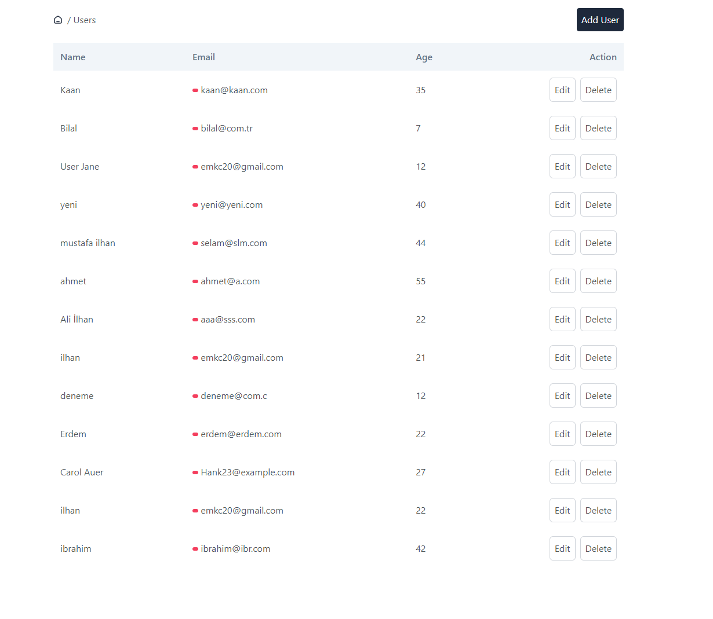

# User List Project



## Project Overview

User List is a project aimed at managing user information. This application allows users to easily update their information, 
delete users when necessary, and add new users.


## Technical Details

- **Technologies:** Our project is developed using **Vue 3 Composition API** and **TypeScript**.
- **Data Source:** User data is dynamically fetched from the **mockapi.io** API.
- **Responsive Design:** The project features a fully responsive design for desktop, tablet, and mobile devices.
- **Styling and Visuals:** For styling and visuals, a user-friendly interface has been created using **Tailwind CSS** and **Sass**.
- **State Management:** **Pinia** is used for state management.
- **Component Structure:** The component structure has been carefully designed.

## Application Link

You can access the application [here](https://users-project-two.vercel.app/).

##  Installation and Running

1. Clone the project:
   ```bash
   git clone <https://github.com/emkc20/users-project.git>

1. Install the necessary dependencies:
   ```bash
   npm install

1. Start the application:
   ```bash
    npm run serve
